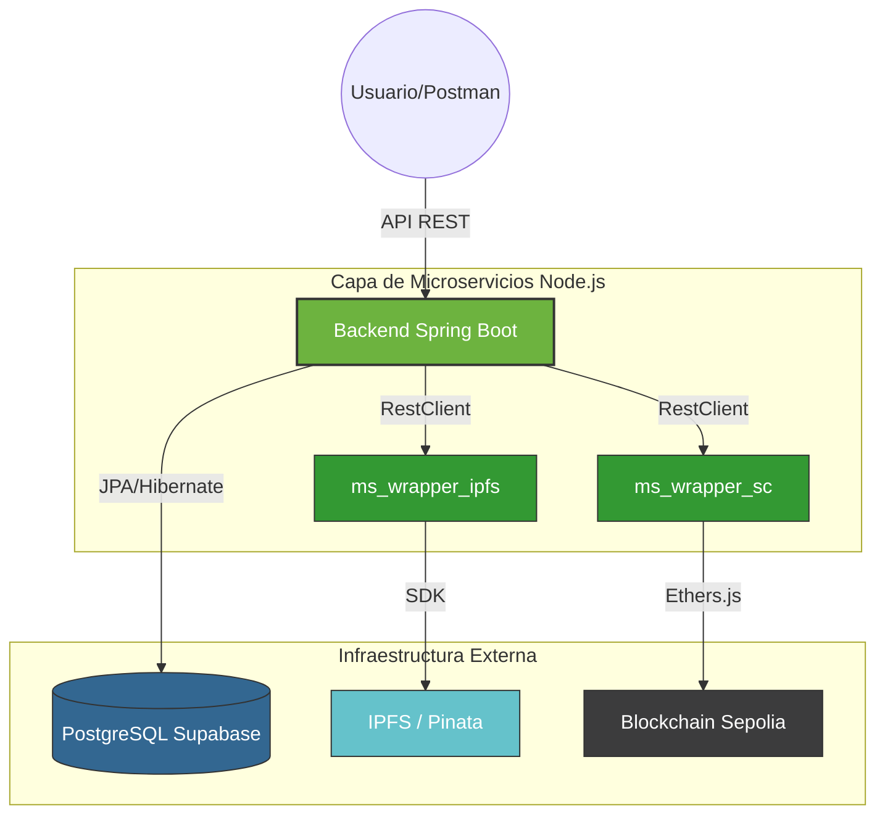

# 🚀 AutorizaMe-Web3-Delivery

**Sistema de Autorización con Blockchain e IPFS para mensajería y reparto.**

[](https://spring.io/projects/spring-boot)
[](https://nodejs.org/)
[](https://ethereum.org/)
[](https://ipfs.tech/)
[](https://www.postgresql.org/)

AutorizaMe-Web3-Delivery es una solución integral para la gestión de autorizaciones en el reparto de pedidos utilizando tecnologías de **Blockchain** y almacenamiento descentralizado (**IPFS**). El sistema garantiza la seguridad y trazabilidad mediante el uso de **NFTs** que actúan como credenciales digitales.

## 📐 Arquitectura del Sistema



---

## 🏗️ Estructura del Proyecto

- **`🍃 Autorizame-api/`**: Backend principal en Spring Boot. Orquestador de lógica, validaciones y persistencia JPA.
- **`📦 ms_wrapper_ipfs/`**: Microservicio Node.js para interactuar con el SDK de Pinata/IPFS.
- **`⛓️ ms_wrapper_sc/`**: Microservicio Node.js para el minteo y transferencia de Smart Contracts (Ethers.js).
- **`📜 contracts/`**: Directorio con el código fuente del Smart Contract (`Autorizame.sol`).
- **`🚜 Farmville/`**: Módulo adicional de procesamiento de datos JDBC y gestión de archivos.

---

## 📡 Catálogo de Endpoints

### 🍃 Backend Spring Boot (API Principal)
| Método | Endpoint | Acción |
| :--- | :--- | :--- |
| `POST` | `/api/v1/pedidos` | **✨ Auto:** Crea registro -> Sube Metadata a IPFS -> Minta NFT en Blockchain. |
| `GET` | `/api/v1/pedidos` | 📋 Consulta todos los pedidos y sus detalles Web3. |
| `GET` | `/api/v1/pedidos/{id}` | 🔍 Detalle de un pedido y sus estados de blockchain. |
| `GET` | `/api/v1/pedidos/blockchain/metadata/{cid}` | ☁️ Recupera el JSON original desde IPFS a través de Spring. |
| `POST` | `/api/v1/pedidos/{id}/transferir` | 🤝 Transfiere la propiedad del NFT al autorizado (Cierre de pedido). |

### 📦 Wrapper IPFS (8081) / ⛓️ Smart Contract (8082)
Endpoints internos invocados de forma transparente por el Backend gestionados mediante `RestClient` de Spring Boot.

---

## 🛠️ Configuración Rápida

1. **🔑 Base de Datos:** Configurar credenciales en `Autorizame-api/src/main/resources/application.properties`.
2. **🔑 IPFS/SC:** Configurar archivos `.env` con las API Keys de Pinata y la Private Key de la Wallet.
3. **🚀 Ejecución simultánea:**
   ```bash
   # Iniciar Microservicios
   npm start --prefix ms_wrapper_ipfs
   npm start --prefix ms_wrapper_sc
   
   # Iniciar Spring Backend
   cd Autorizame-api && ./mvnw spring-boot:run
   ```

---

## 👥 Autor
- **Iván Ramírez** - [@ivanramirez2](https://github.com/ivanramirez2)
