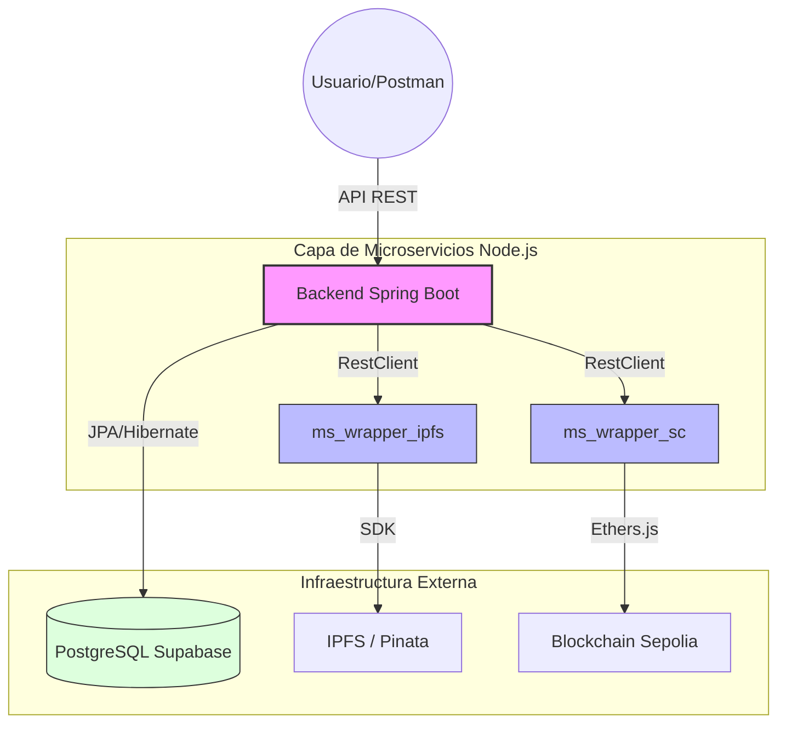

# 🚀 Autorizame - Sistema de Autorización con Blockchain e IPFS

Autorizame es una solución integral para la gestión de autorizaciones en el reparto de pedidos utilizando tecnologías de **Blockchain** y almacenamiento descentralizado (**IPFS**).

## 📐 Arquitectura del Sistema



---

## 🏗️ Estructura del Proyecto

- **`Autorizame-api/`**: Backend principal en Spring Boot. Gestiona la lógica, seguridad y persistencia.
- **`ms_wrapper_ipfs/`**: Microservicio en Node.js para interactuar con el SDK de Pinata.
- **`ms_wrapper_sc/`**: Microservicio en Node.js para interactuar con Smart Contracts mediante Ethers.js.
- **`Farmville/`**: Proyecto adicional de gestión de base de datos mediante JDBC y procesamiento de ficheros.

---

## 📡 Catálogo de Endpoints

### 🍃 Backend Spring Boot (Puerto 8080)
| Método | Endpoint | Descripción |
| :--- | :--- | :--- |
| `POST` | `/api/v1/pedidos` | **Automático:** Crea pedido -> Sube a IPFS -> Minta NFT. |
| `GET` | `/api/v1/pedidos` | Lista todos los pedidos y sus IDs de Blockchain. |
| `GET` | `/api/v1/pedidos/{id}` | Detalle de un pedido específico. |
| `GET` | `/api/v1/pedidos/blockchain/metadata/{cid}` | Recupera el JSON de IPFS desde el Backend. |
| `POST` | `/api/v1/pedidos/{id}/transferir` | Ejecuta la transferencia del NFT al autorizado. |
| `GET` | `/api/v1/clientes` | Gestión de clientes (necesario address wallet). |
| `GET` | `/api/v1/autorizados` | Gestión de autorizados (necesario address wallet). |

### 📦 Wrapper IPFS (Puerto 8081)
| Método | Endpoint | Descripción |
| :--- | :--- | :--- |
| `POST` | `/subirMetadata` | Sube un JSON a IPFS y devuelve el CID. |
| `GET` | `/recuperarMetadata/{cid}` | Descarga el JSON desde IPFS. |

### ⛓️ Wrapper Smart Contract (Puerto 8082)
| Método | Endpoint | Descripción |
| :--- | :--- | :--- |
| `POST` | `/mintarAutorizacion` | Minta un nuevo NFT en Sepolia. |
| `POST` | `/transferirAutorizacion` | Cambia el owner de un NFT existente. |

---

## 🛠️ Configuración Rápida

1. **Base de Datos:** Configurar `application.properties` en el backend con las credenciales de Supabase.
2. **IPFS:** Configurar `.env` en `ms_wrapper_ipfs` con tu `PINATA_JWT`.
3. **Blockchain:** Configurar `.env` en `ms_wrapper_sc` con tu `RPC_URL` y `OWNER_PRIVATE_KEY`.

## 🚀 Ejecución
Para que el sistema funcione correctamente, los tres servicios deben estar activos simultáneamente:
```bash
# Terminal 1
cd ms_wrapper_ipfs && npm start

# Terminal 2
cd ms_wrapper_sc && npm start

# Terminal 3
cd Autorizame-api && ./mvnw spring-boot:run
```

---

## 👥 Autor
- **Iván Ramírez** - [GitHub](https://github.com/ivanramirez2)
